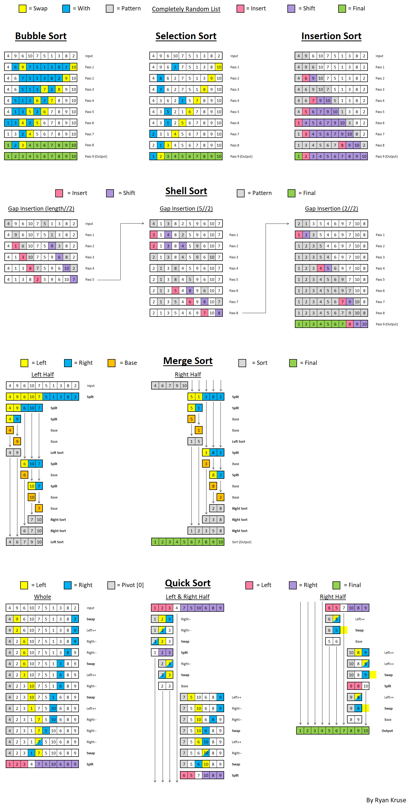

# Python RTS
In this project, I write code using data structures and algorithms to solve various programming problems using Python.

## Data Structure Timer Graphs

	</img>

	</img>

	</img>

	</img>

## Recursion Graphics Using Python Turtles

	</img>

	</img>

	</img>

	</img>

## Visualization of Sorting Logic in Excel

	</img>

