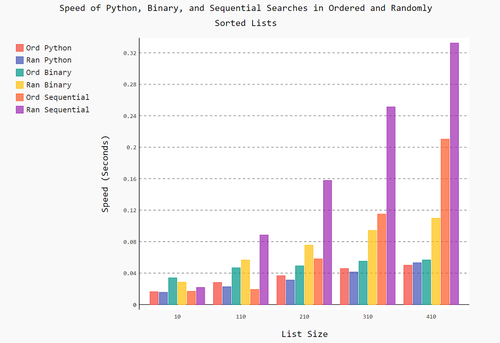

# Python RTS
In this project, I write code using data structures and algorithms to solve various programming problems using Python.

## Data Structure Timer Graphs

##### Push and Pop Stack Times

	</img>

##### Enqueue and Dequeue Queue Times

	</img>

##### Python, Binary, and Sequential Search Times

	</img>

## Recursion Graphics Using Python Turtles

##### Tree

	</img>

##### Hilbert Maze

	</img>

##### Koch Snowflake

	</img>

##### Sierpinski's Triangle

	</img>

## Visualization of Sorting Algorithms in Excel

	</img>

